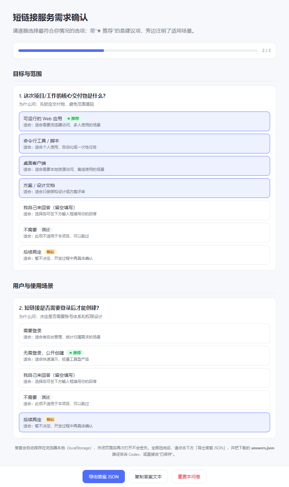

# development-intent-anchor-point（开发意图锚点）

一个 Codex 插件：把“确认需求”从口头交代变成可迭代的苏格拉底问答流程，让 AI 在动手前锚定你的真实
意图；开发过程中遇到不确定的问题先问你，而不是自己猜。

## 为什么需要它

- **AI 会在需求模糊时自行假设**：方向错了就要返工，成本最高；
- **口头说一遍需求，细节容易漏**：范围、边界、技术栈、交付物、验收标准，全靠一次对话根本说不完；
- **开发中遇到未明确的问题**：AI 猜一个方案 vs 停下来问你一句，二者对项目走向的影响天差地别。

这个插件把“确认需求”变成一套可重复的流程：问卷 → 答案 → 需求文档 → 迭代确认 → 开工，并在整个开发
过程中坚持“不臆断”原则。

## 功能

### 场景一：项目启动时自动确认需求

当你开始一个新项目、计划、任务或系统时：

1. Codex 根据你的描述，定制一份苏格拉底问答式问卷（8–20 题），覆盖目标与范围、用户与场景、功能需求、
   非功能需求、技术栈、数据与集成、交付与时间、风险与约束；
2. 生成**自包含的 HTML 问卷**并自动在浏览器打开，无需联网；
3. 每道题都给出：多个选项（标注“★ 推荐”项及适用场景），选项支持单选或多选，另有留空自定义回答、
   **不需要**、**后续再定**；
4. 答案自动保存在浏览器本地，点「保存答案」即自动写入问卷同目录的 `answers.json`；
5. Codex 读取答案，生成 `requirements.md`（需求/计划文档），已确认项与待确认项分开标注；
6. 还有未决问题就再来一轮问卷，直到你说“开始工作”；
7. 确认后自动删除临时问卷文件，保留 `requirements.md`，严格按文档开工。

### 场景二：开发中不臆断

- 遇到需求文档没覆盖、存在多种合理做法的决策点，**停下来问你**；
- 提问格式：一句话背景 + 推荐方案及理由 + 1–3 个备选方案 + “稍后再定”选项；
- 不自行假设，除非你明确授权“小问题自己决定”。

## 安装

需要 [Codex CLI](https://developers.openai.com/codex/cli) 或 Codex 桌面应用（支持插件）。

```bash
# 1. 注册仓库 marketplace（克隆到本地后也可以用本地路径）
codex plugin marketplace add https://gitee.com/wanan6/development-intent-anchor-point.git

# 2. 安装插件
codex plugin add development-intent-anchor-point@development-intent-anchor-point
```

安装完成后请**开一个新任务**使用（新任务才会加载新技能）。

## 使用示例

```text
我：我要做一个短链接服务，先确认一下需求。
Codex：好的，我生成了需求问卷并在浏览器打开，请逐题点选（带“★ 推荐”的是建议项），
       答完点「保存答案」会自动写入问卷同目录，或直接说“已保存”。
我：已保存。
Codex：已生成 requirements.md，还有 3 个“后续再定”的问题，我开了第二轮问卷……
我：就这样，开始工作。
Codex：已删除临时问卷文件，开始按 requirements.md 实现。
```

## 预览



## 仓库结构

```text
development-intent-anchor-point/
├── .agents/plugins/marketplace.json    # Codex 仓库 marketplace 清单
├── plugins/development-intent-anchor-point/
│   ├── .codex-plugin/plugin.json       # 插件清单
│   ├── skills/development-intent-anchor-point/SKILL.md   # 技能：需求确认工作流
│   └── scripts/                        # 问卷生成 / 打开 / 答案读取脚本
├── docs/questionnaire-preview.png      # 问卷界面预览
├── CHANGELOG.md                        # 更新记录与更新方式
└── README.md                           # 本文件
```

更新内容与更新方式见 [CHANGELOG.md](CHANGELOG.md)。

## 工作流中的文件

- 临时目录 `.requirements-work/`：`questions.json`、`questionnaire.html`、`answers.json`
  （确认完成后整体删除）；
- 保留产物：项目根目录的 `requirements.md`。

## 常见问题

- **会一直弹问卷吗？** 只在你说“开始新项目/确认需求”或需求明显不完整时触发；开发中只有遇到未明确的
  决策点才会提问。
- **不想答题，想直接说？** 可以直接在对话里回答，Codex 同样会更新需求文档。
- **如何更新插件？** 重新执行 `codex plugin add development-intent-anchor-point@development-intent-anchor-point`
  即可拉取最新版本。
